# OtakuVerse

## 📋 Descrição

**OtakuVerse** é uma aplicação web feita para os fãs de anime que desejam explorar, descobrir e organizar seus títulos favoritos em um só lugar. Aqui, você pode pesquisar por animes, conferir sinopses, ver as avaliações da comunidade e montar a sua própria lista personalizada de obras.

---

## 🤖 Tecnologias

- Figma: Usado para o design de interfaces e prototipação do layout do OtakuVerse, garantindo uma experiência de usuário moderna e intuitiva.

- Framework Django: Framework backend em Python, responsável por gerenciar a lógica do sistema, banco de dados, autenticação e integração de funcionalidades.

- Jira: Ferramenta de gestão de tarefas e acompanhamento do fluxo de desenvolvimento, permitindo organização do time e controle de sprints.

---

## 🔗 Links

    
    
    
    

---

🚀 PRIMEIRA ENTREGA

Esta primeira focará na base do sistema, com o layout e as funcionalidades básicas sendo prototipadas e também uma introdução a prática SCRUM.

Criamos um prototipo de baixa fidelidade no [figma](https://www.figma.com/design/6Q4DkRQeQO5bq2jOZrwhfO/OtakuVerse?t=B29iLpEUN9gL3O8G-1) das histórias de usuário que colocamos em nosso sprint do jira, também criamos um [docs](https://docs.google.com/document/d/1Y8RcR2egMJ4rOE_O9AO1JHqaPqj51M2uxXOSbzNYWv0/edit?usp=sharing) para apresentar melhor as histórias com cenários de validação usando BDD.

Também foi feito um screencast apresentando nosso protótipo que está disponível no youtube através deste [link](https://youtu.be/sO74KHClKPc).

Nosso figma contem as telas de login, cadastro, listas, busca, ranking, detalhes e avaliação:
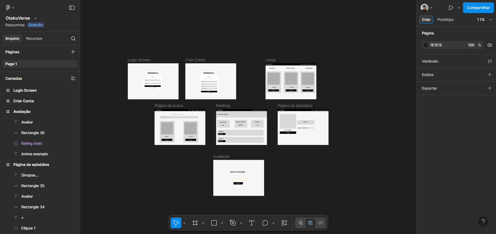

O jira com nosso backlog e primeira sprint:
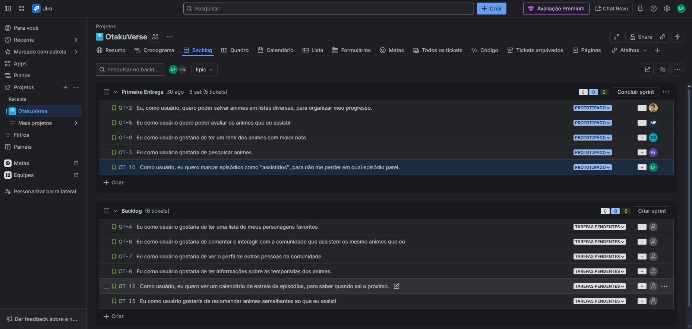

Nosso board:
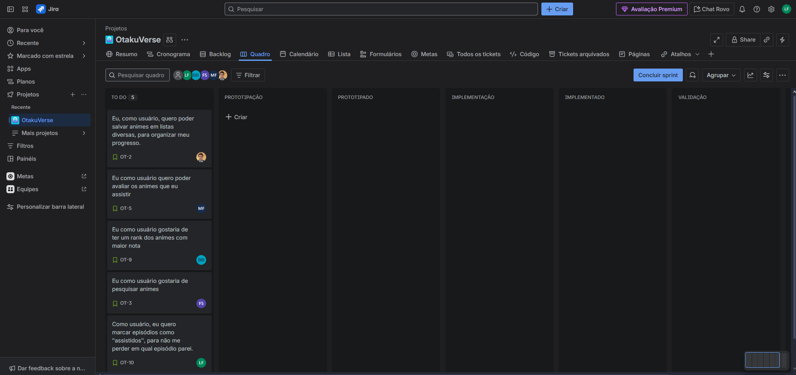

---

🚀 SEGUNDA ENTREGA

Nessa entrega começamos a implementação real do projeto, escolhendo 3 histórias de usuário para darmos deploy.

## Histórias implementadas:

### 1. Eu como usuário gostaria de pesquisar animes.

#### Cenário 1: Usuário pesquisa um anime existente
- Dado que estou logado no sistema e estou na página de pesquisa;
- Quando eu digito o nome de um anime existente e clico em pesquisar;
- Então devo ver uma lista de títulos com o nome que pesquisei.

#### Cenário 2: Pesquisa sem resultados
- Dado que estou logado no sistema e estou na página de pesquisa;
- Quando eu digito um nome de um anime inexistente e clico em pesquisar;
- Então devo ver uma mensagem indicando que nenhum resultado foi encontrado.

#### Cenário 3: Usuário pesquisa um anime com parte do título
- Dado que estou logado no sistema e estou na página de pesquisa;
- Quando eu digito uma parte do título de um anime e clico em pesquisar;
- Então devo ver uma lista de animes cujo título contenha a parte do título que pesquisei.

    ### Pesquisa com resultados:

    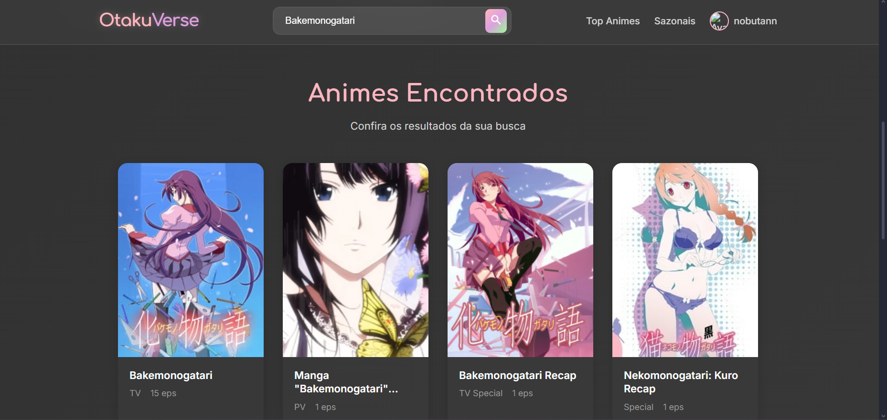

    ### Pesquisa sem resultados:

    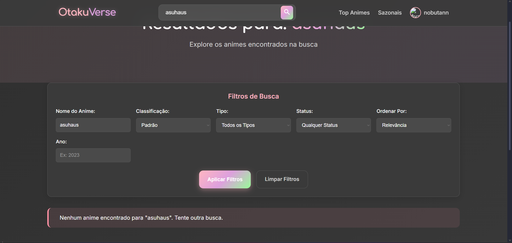

    ### Pesquisa parcial:

    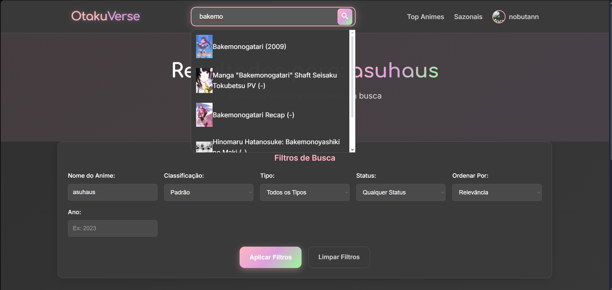

### 2. Eu, como usuário, quero poder avaliar os animes que assisti.

#### - Cenário 1: Usuário avalia um anime com nota;
- Dado que estou logado no sistema e estou na página de detalhes de um anime que eu assisti;
- Quando eu seleciono uma nota de 1 a 10;
- Então a minha avaliação deve ser registrada e ser exibida em meu perfil;

#### - Cenário 2: Usuário altera sua avaliação;
- Dado que já avaliei um anime;
- Quando eu seleciono uma nova nota;
- Então a nova avaliação deve substituir a antiga e ser exibida corretamente no meu perfil;

#### - Cenário 3: O usuário tenta avaliar um anime que não assistiu;
- Dado que estou logado no sistema e estou na página de detalhes de um anime que eu não comecei;
- Quando tento selecionar uma nota;
- Então o sistema deve mostrar uma mensagem de que não se pode avaliar antes de assistir o anime;

    ### Avaliar sem ter assistido:

    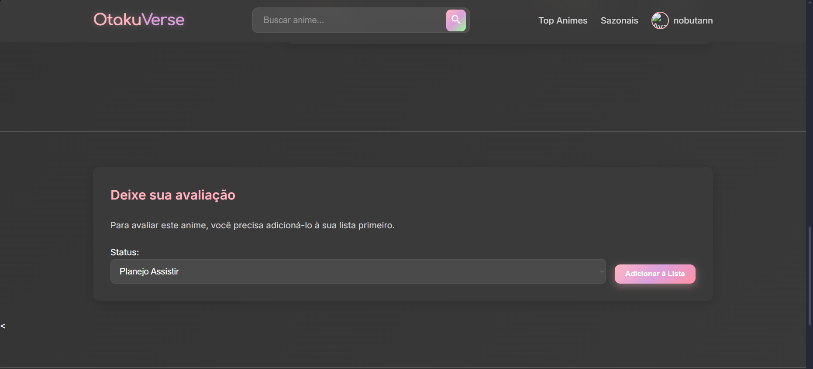

    ### Mostrar nota:

    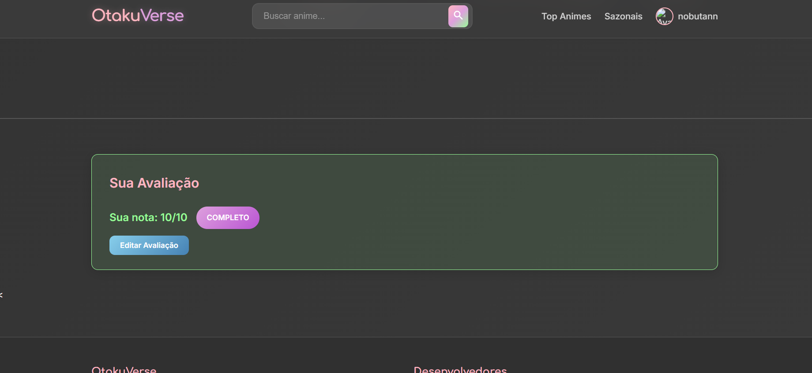

    ### Trocar nota:

    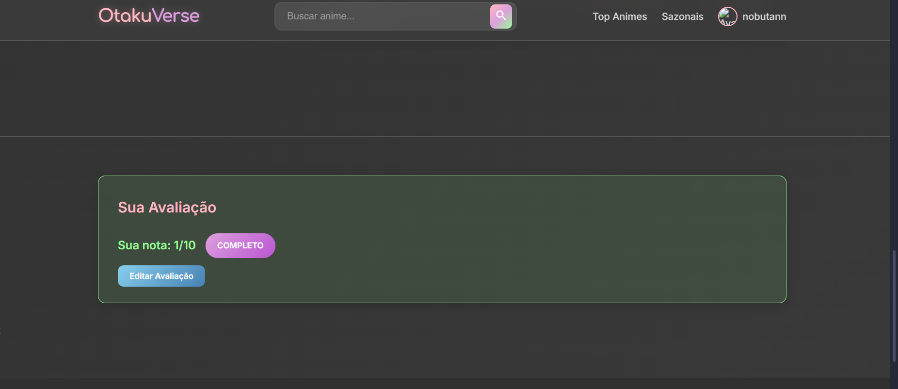

### 3. Eu, como usuário, quero poder salvar animes em listas personalizadas.

#### - Cenário 1: Usuário adiciona ou atualiza um anime em uma lista;
- Dado que estou logado no sistema e estou na página de detalhes de um anime;
- Quando eu seleciono a opção de adicionar a lista e escolho a lista desejada;
- Então o anime deve aparecer na lista desejada e estar associado ao meu perfil e se o anime já estava em outra lista deve ser removido de lá;

#### - Cenário 2: Usuário remove um anime de uma lista;
- Dado que estou logado no sistema e tenho o anime em uma lista;
- Quando eu removo o anime dessa lista;
- Então ele não deve mais aparecer lá;

#### - Cenário 3: Usuário visualiza suas listas;
- Dado que estou logado no sistema;
- Quando eu acesso a área “Minha Lista”;
- Então devo ver as listas “Quero Assistir”, “Assistindo” e “Concluídos”;

    ### Adicionar à lista:

    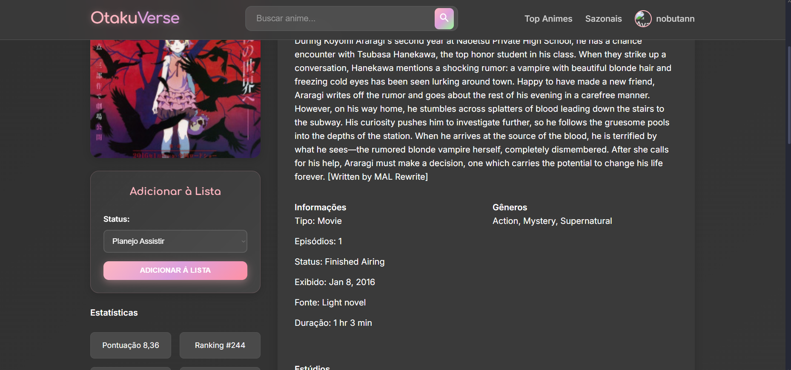

    ### Página de listas:

    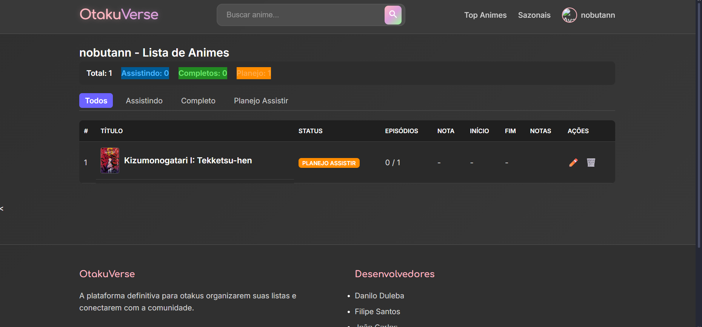

    ### Editar ou remover da lista:

    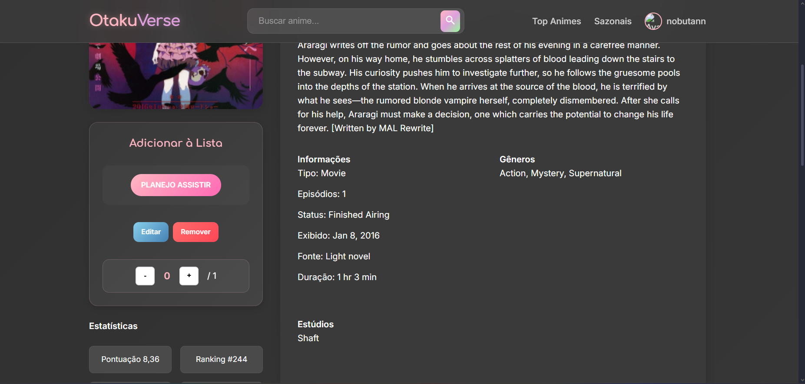

---

## Jira

Atualizamos o Jira com a nova sprint para gerenciar o andamento de nosso projeto e organizar nossas atividades.

### Backlog:

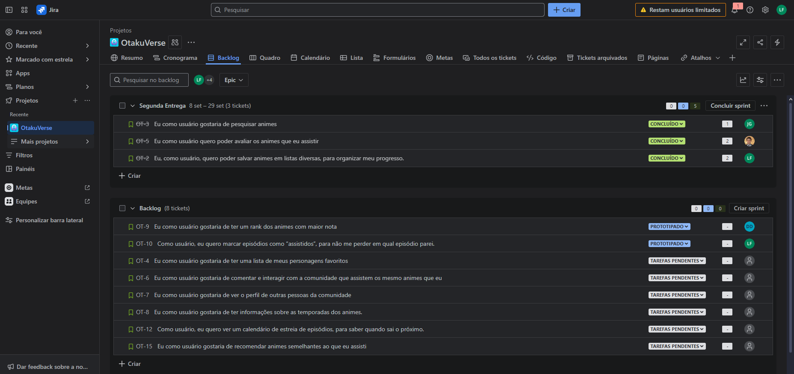

### Board:

## Screencast

Neste screencast apresentamos o OtakuVerse, destacando as funcionalidades de pesquisa de animes, sistema de avaliação e criação de listas personalizadas para organizar o que já foi assistido. Você pode acessa-lo [clicando aqui](https://youtu.be/YGVYSygkDoc).

## Bugtracker

Utilizamos o bug tracker do GitHub para registrar erros encontrados no projeto, acompanhar correções e documentar melhorias realizadas no OtakuVerse.
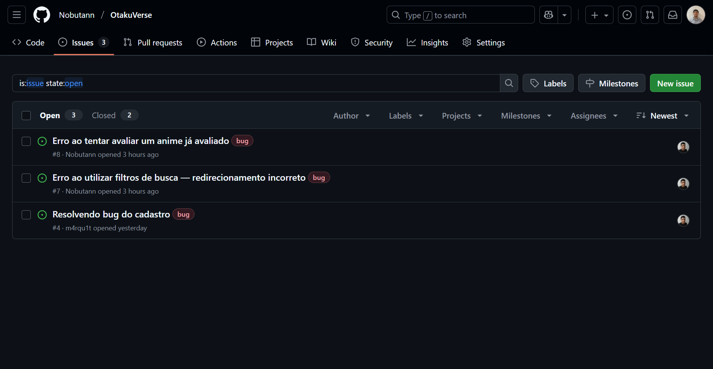

### Redirecionamento incorreto nas listas:

- Anteriormente, ao adicionar ou acessar um anime, o sistema encaminhava o usuário para a página errada, exibindo sempre o primeiro registro em vez do anime selecionado. Após a correção, o fluxo foi ajustado: agora o redirecionamento leva corretamente para a página do anime escolhido, preservando a navegação esperada.

### Duplicidade de animes no banco:

- Havia um problema em que o código não validava se o anime já estava cadastrado, o que resultava em entradas duplicadas no banco de dados. Essa lógica foi revisada, e atualmente o sistema verifica a existência do anime antes de criar um novo registro, garantindo a integridade das informações.

### Erro após cadastro de usuário:

- Durante os testes, foi identificado que, ao concluir o processo de cadastro, o sistema até registrava corretamente os dados no banco, mas redirecionava o usuário para uma página de erro. Esse comportamento gerava confusão, pois dava a impressão de que o cadastro não havia sido realizado.

## Relatório Pair programing
- Durante o desenvolvimento do OtakuVerse, adotamos a prática de Pair Programming como estratégia para aumentar a colaboração e a qualidade do código. Trabalhando em 		duplas, um integrante assumia o papel de driver, escrevendo o código, enquanto o outro atuava como navigator, revisando e sugerindo melhorias em tempo real. Essa 			dinâmica favoreceu a troca de conhecimento, a rápida detecção de falhas e a integração entre os membros da equipe. Para acessa-lo, [Abra o pdf](docs/pair_programming.pdf).

---

🚀 TERCEIRA ENTREGA

Nesta terceira entrega, ampliamos significativamente as funcionalidades do **OtakuVerse**, aprimorando a experiência do usuário e consolidando o sistema com novas histórias implementadas e melhorias gerais.

# Histórias implementadas:

## História 1: Visualizar o ranking dos animes com as maiores notas

- Cenário 1: Visualizar o top ranking dos animes de acordo com a avaliação
  
  - Dado que o usuário está logado e deseja visualizar a ordem do top ranking dos animes com maiores notas;
  - Quando seleciona a aba de top animes;
  - Então uma lista crescente dos animes aparecerá.

### Top animes:

---
## História 2: Visualizar o perfil de outras pessoas da comunidade

---

- Cenário 1: Pesquisar e visualizar o perfil de outro usuário

  - Dado que o usuário está logado e deseja acessar o perfil de outro usuário;
  - Quando pesquisa o nome do usuário desejado na barra de pesquisa;
  - Então o perfil correspondente será exibido com as informações disponíveis.
 
- Cenário 2: Exibir mensagem quando o perfil pesquisado não for encontrado

  - Dado que o usuário está logado e deseja acessar o perfil de outro usuário;
  - Quando pesquisa por um nome que não corresponde a nenhum usuário cadastrado;
  - Então uma mensagem informando que “nenhum usuário foi encontrado” será exibida na tela.
 
### Pesquisar e visualizar perfil:

### Pesquisa de usuário não encontrado:

---

## História 3: Visualizar informações sobre as temporadas que serão lançadas

---

- Cenário 1: Entrar na aba sazonais e visualizar quais animes serão lançados

  - Dado que o usuário está logado e desejar visualizar informações sobre o lançamento de novas temporadas/animes;
  - Quando estiver na aba sazonais;
  - Então poderá visualizar as informações sobre as temporadas de lançamento, divididos em estações do ano.

### Aba sazonais:
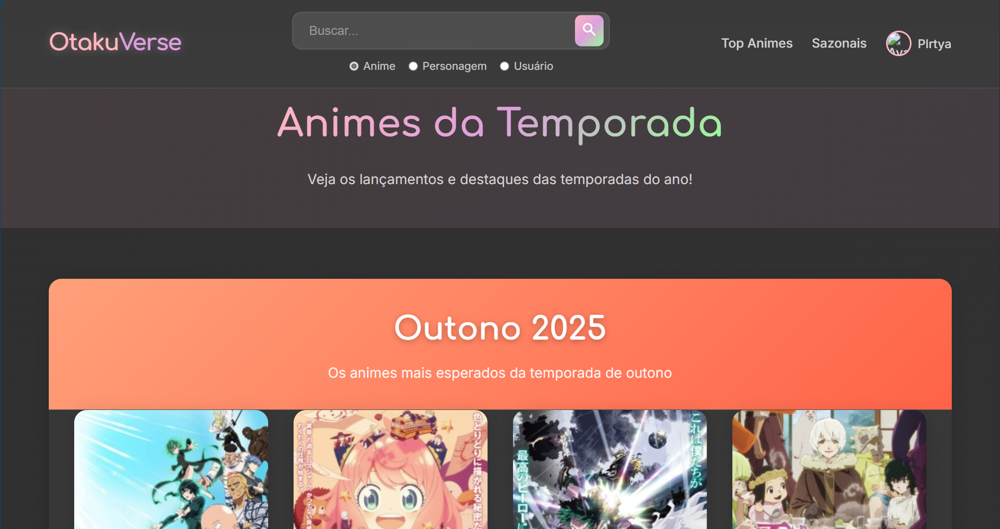

---

## História 4: Pesquisar e visualizar personagens de animes

---

- Cenário 1: Pesquisar um personagem válido e aparecer:

  - Dado que o usuário está logado e deseja pesquisar para visualizar o personagem;
  - Quando estiver na opção de pesquisar personagens;
  - Então poderá visualizar os personagens com o nome digitado.

- Cenário 2: Pesquisar um personagem inválido e não ser encontrado:

  - Dado que o usuário está logado e deseja pesquisar para visualizar o personagem;
  - Quando digitar um nome de personagem inválido;
  - Então poderá visualizar personagem não encontrado.

### Pesquisa personagem válida:
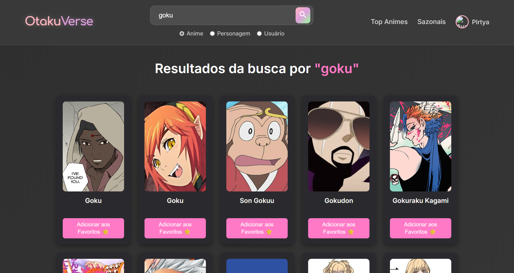

### Pesquisa personagem inválida:
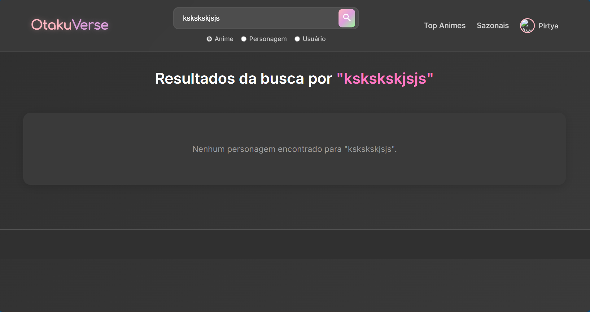

---
---

# Jira

Atualizamos o Jira com uma nova sprint para acompanhar as atividades desta entrega, mantendo a organização e a clareza das tarefas.

### Backlog:
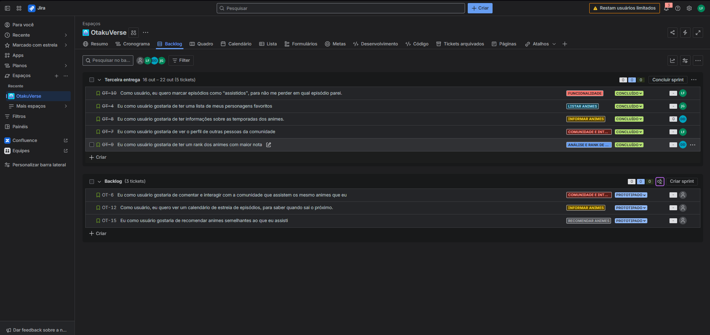

### Board:
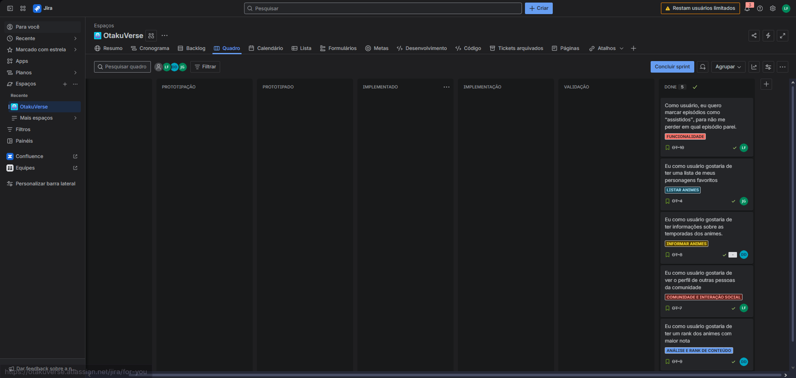

---

# Screencast

Nesta entrega, produzimos um screencast demonstrando as funcionalidades recém-implementadas, além de apresentar o fluxo de deploy, os testes realizados no Cypress e a integração com o CI/CD.

  

---

# Bugtracker

Implementamos uma nova seção de bug tracker para gerenciar de forma organizada as falhas identificadas e as melhorias realizadas nesta sprint.

## Open

---

## Closed
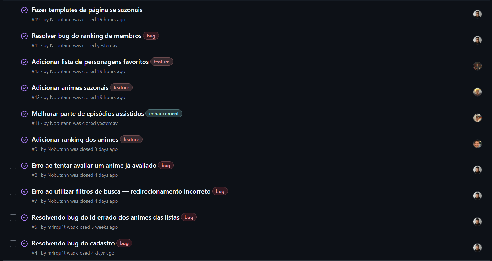

---

> 💡 Cada issue registrada contém título, descrição, prioridade e status de andamento

---

# Relatório Pair Programming

Continuamos aplicando a prática de Pair Programming para aumentar a colaboração entre os membros e reduzir falhas.  
📄 [Acesse o PDF](docs/pair_programming.pdf)

---
---

---

🚀 QUARTA ENTREGA

Durante a quarta entrega, a equipe do OtakuVerse focou no desenvolvimento de funcionalidades avançadas voltadas para personalização, interação comunitária e acompanhamento de lançamentos. As histórias planejadas e executadas nesta sprint foram:

# Histórias implementadas:

## História 1: Recomendar animes semelhantes ao que o usuário assistiu

- Cenário 1: Exibir recomendações baseadas nos animes assistidos:

  - Dado que o usuário está logado e já assistiu a alguns animes;
  - Quando acessa a página inicial ou a área de recomendações;
  - Então uma lista de animes semelhantes aos que assistiu deve aparecer.

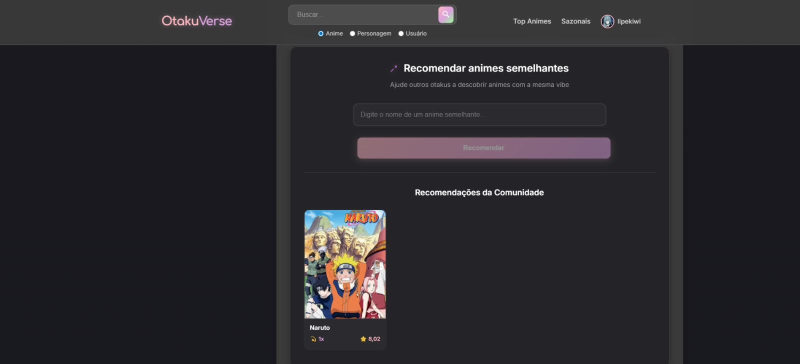
---
## História 2: Sistema de comentários e interação comunitária

- Cenário 1: Usuário comentar em um anime:

  - Dado que o usuário está logado e acessa a página de detalhes de um anime;
  - Quando escreve um comentário e clica para enviar;
  - Então o comentário deve aparecer listado junto aos demais comentários daquele anime.

    
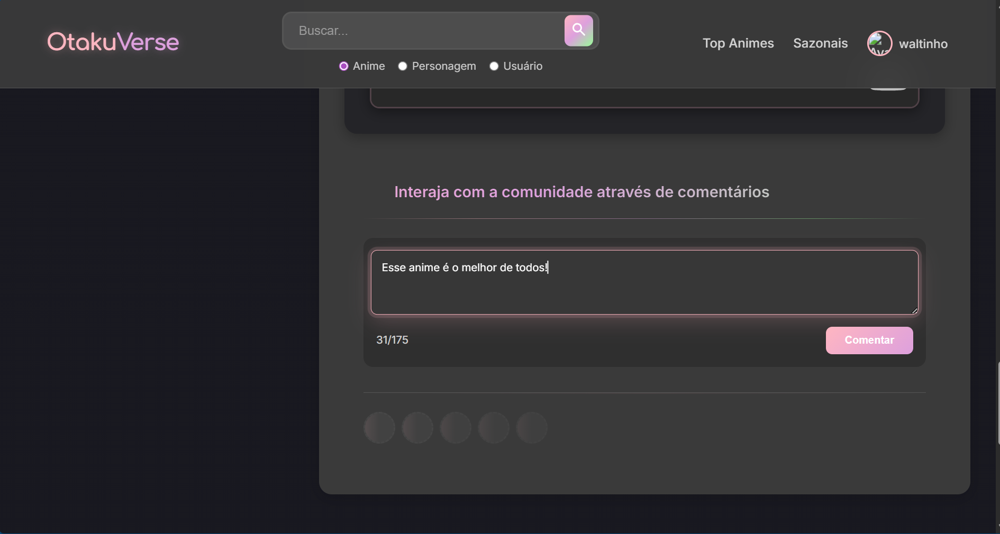
---

## História 3: Calendário de estreias de episódios (Em validação)

---

# Jira

Atualizamos o Jira com uma nova sprint para acompanhar as atividades desta entrega, mantendo a organização e a clareza das tarefas.

### Board:
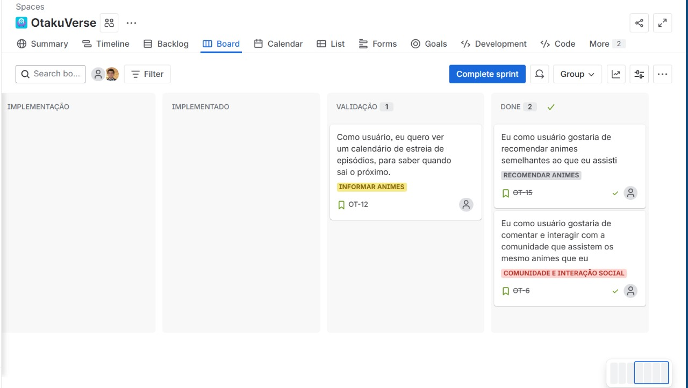
---

# Screencast

descrição do screencast

  
links

---

# Bugtracker

descrição do bugtracker

## Open
imagem

---

## Closed
imagem

---

> 💡 Cada issue registrada contém título, descrição, prioridade e status de andamento

---

# Relatório Pair Programming

Continuamos aplicando a prática de Pair Programming para aumentar a colaboração entre os membros e reduzir falhas.  
📄 [Acesse o PDF](link)

---
---

